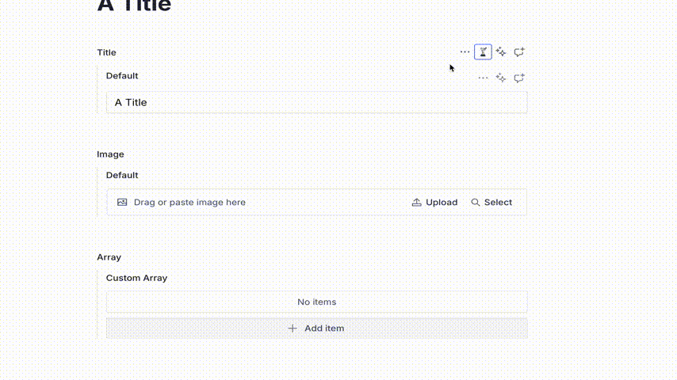

# @sanity/personalization-plugin

## Previously know as @sanity/personalisation-plugin

> This is a **Sanity Studio v3** plugin.

This plugin allows users to add a/b/n testing experiments to individual fields.



For this plugin you need to defined the experiments you are running and the variations those experiments have. Each experiment needs to have an id, a label, and an array of variants that have an id and a label. You can either pass an array of experiments in the plugin config, or you can use and async function to retrieve the experiments and variants from an external service like growthbook, Amplitude, LaunchDarkly... You could even store the experiments in your sanity dataset.

Once configured you can query the values using the ids of the experiment and variant

- [@sanity/personalization-plugin](#@sanity/personalization-plugin)
  - [Installation](#installation)
  - [Usage](#usage)
  - [Loading Experiments](#loading-experiments)
  - [Using complex field configurations](#using-complex-field-configurations)
  - [Validation of individual array items](#validation-of-individual-array-items)
  - [Shape of stored data](#shape-of-stored-data)
  - [Querying data](#querying-data)
  - [License](#license)
  - [Develop \& test](#develop--test)
    - [Release new version](#release-new-version)
  - [License](#license-1)

## Installation

```sh
npm install @sanity/personalization-plugin
```

## Usage

Add it as a plugin in `sanity.config.ts` (or .js):

```ts
import {defineConfig} from 'sanity'
import {fieldLevelExperiments} from '@sanity/personalization-plugin'

const experiment1 = {
  id: '123',
  label: 'experiment 1',
  variants: [
    {
      id: '123-a',
      label: 'first var',
    },
    {
      id: '123-b',
      label: 'second var',
    },
  ],
}
const experiment2 = {
  id: '456',
  label: 'experiment 2',
  variants: [
    {
      id: '456-a',
      label: 'b first var',
    },
    {
      id: '456-b',
      label: 'b second var',
    },
  ],
}

export default defineConfig({
  //...
  plugins: [
    //...
    fieldLevelExperiments({
      fields: ['string'],

      experiments: [experiment1, experiment2],
    }),
  ],
})
```

This will register two new fields to the schema., based on the setting passed intto `fields:`

- `experimentString` an Object field with `string` field called `default`, a `string` field called `experimentId` and an array field of type:
- `varirantsString` an object field with a `string` field called `value`, a string field called `variantId`, a `string` field called `experimentId`.

Use the experiment field in your schema like this:

```ts
//for Example in post.ts

fields: [
  defineField({
    name: 'title',
    type: 'experimentString',
  }),
]
```

## Loading Experiments

Experiments must be an array of objects with an id and label and an array of variants objects with an id and label.

```ts
experiments: [
  {
    id: '123',
    label: 'experiment 1',
    variants: [
      {
        id: '123-a',
        label: 'first var',
      },
      {
        id: '123-b',
        label: 'second var',
      },
    ],
  },
  {
    id: '456',
    label: 'experiment 2',
    variants: [
      {
        id: '456-a',
        label: 'b first var',
      },
      {
        id: '456-b',
        label: 'b second var',
      },
    ],
  },
]
```

Or an asynchronous function that returns an array of objects with an id and label and an array of variants objects with an id and label.

```ts
experiments: async () => {
  const response = await fetch('https://example.com/experiments')
  const {externalExperiments} = await response.json()

  const experiments: ExperimentType[] = externalExperiments?.map(
    (experiment) => {
      const experimentId = experiment.id
      const experimentLabel = experiment.name
      const variants = experiment.variations?.map((variant) => {
        return {
          id: variant.variationId,
          label: variant.name,
        }
      })
      return {
        id: experimentId,
        label: experimentLabel,
        variants,
      }
    },
  )
  return experiments
}
```

The async function contains a configured Sanity Client in the first parameter, allowing you to store Language options as documents. Your query should return an array of objects with an id and title.

```ts
experiments: async (client) => {
    const experiments = await client.fetch(`*[_type == 'experiment']`)
    return experiments
  },
```

## Using complex field configurations

For more control over the value field, you can pass a schema definition into the fields array.

```ts
import {defineConfig} from 'sanity'
import {fieldLevelExperiments} from '@sanity/personalization-plugin'

export default defineConfig({
  //...
  plugins: [
    //...
    fieldLevelExperiments({
      fields: [
        defineField({
          name: 'featuredProduct',
          type: 'reference',
          to: [{type: 'product'}],
          hidden: ({document}) => !document?.title,
        }),
      ],
      experiments: [experiment1, experiment2],
    }),
  ],
})
```

This would also create two new fields in your schema.

- `experimentFeaturedProduct` an Object field with `reference` field called `default`, a `string` field called `experimentId` and an array field of type:
- `variantFeaturedProduct` an object field with a `reference` field called `value`, a string field called `variandId`, a `string` field called `experimentId`.

Note that the name key in the field gets rewritten to value and is instead used to name the object field.

## Validation of individual array items

You may wish to validate individual fields for various reasons. From the variant array field, add a validation rule that can look through all the array items, and return item-specific validation messages at the path of that array item.

```ts
defineField({
  name: 'title',
  title: 'Title',
  type: 'experimentString',
  validation: (rule) =>
    rule.custom((experiment: ExperimentGeneric<string>) => {
      if (!experiment.default) {
        return 'Default value is required'
      }

      const invalidVariants = experiment.variants?.filter((variant) => !variant.value)

      if (invalidVariants?.length) {
        return invalidVariants.map((item) => ({
          message: `Variant is missing a value`,
          path: ['variants', {_key: item._key}, 'value'],
        }))
      }
      return true
    }),
}),
```

## Shape of stored data

The custom input contains buttons which will add new array items with the experiment and variant already populated. Data returned from this array will look like this:

```json
"title": {
  "default": "asdf",
  "experimentValue": "test-1",
  "variants": [
    {
      "experimentId": "test-1",
      "value": "asdf",
      "variantId": "test-1-a"
    },
    {
      "experimentId": "test-1",
      "variantId": "test-1-b",
      "value": "asdf"
    }
  ]
}
```

Querying data
Using GROQ filters you can query for a specific experitment, with a fallback to default value like so:

```ts
*[_type == "post"] {
"title":coalesce(title.variants[experimentId == $experiment && variantId == $variant][0].value, title.default),
}
```

## License

[MIT](LICENSE) © Jon Burbridge

## Develop & test

This plugin uses [@sanity/plugin-kit](https://github.com/sanity-io/plugin-kit)
with default configuration for build & watch scripts.

See [Testing a plugin in Sanity Studio](https://github.com/sanity-io/plugin-kit#testing-a-plugin-in-sanity-studio)
on how to run this plugin with hotreload in the studio.

### Release new version

Run ["CI & Release" workflow](https://github.com/sanity-io/sanity-plugin-personalization/actions/workflows/main.yml).
Make sure to select the main branch and check "Release new version".

Semantic release will only release on configured branches, so it is safe to run release on any branch.
